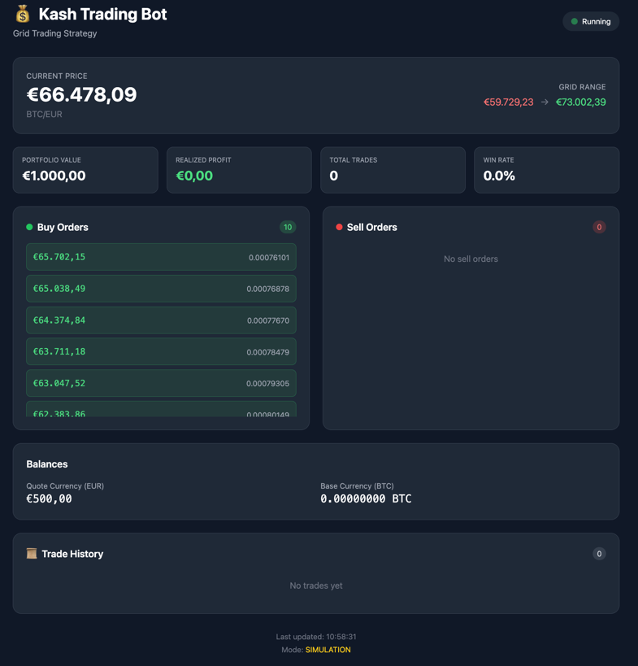

# Kash

A grid trading bot for cryptocurrency markets. Profits from price volatility by placing layered buy/sell orders.

## How It Works

```
Price ↑    SELL orders placed above current price
  ●────────────────────────────
  ●────────────────────────────
  ●──────────────────────────── ← Current price
  ●────────────────────────────
  ●────────────────────────────
Price ↓    BUY orders placed below current price
```

- Places a grid of buy orders below and sell orders above current price
- When price drops → buys; when price rises → sells
- Captures profit from sideways/volatile markets without predicting direction

## Screenshot



## Features

- **Spot trading only** — no leverage, no liquidation risk
- **Configurable grid** — adjust levels, range, and order sizes
- **Stop-loss protection** — automatic panic sell on major drops
- **Simulation mode** — paper trade before going live
- **Web UI** — real-time dashboard at `http://localhost:8080`

## Quick Start

```bash
# Clone and setup
git clone https://github.com/YOUR_USERNAME/kash.git
cd kash
python -m venv .venv
source .venv/bin/activate
pip install -r requirements.txt

# Configure
cp .env.example .env
# Edit .env with your settings

# Run simulation
python -m kash.main --simulation
```

## Configuration

Set via `.env` file or CLI flags:

| Variable | Default | Description |
|----------|---------|-------------|
| `TRADING_PAIR` | BTC/EUR | Trading pair (e.g., ETH/USDT, XRP/EUR) |
| `INVESTMENT` | 1000 | Capital to deploy (in quote currency) |
| `GRID_COUNT` | 20 | Number of grid levels |
| `GRID_RANGE_PERCENT` | 10 | Grid range ±% from current price |
| `STOP_LOSS_PERCENT` | 15 | Panic sell trigger % |
| `TRADING_MODE` | simulation | `simulation` or `live` |

## CLI Options

```bash
python -m kash.main [OPTIONS]

Options:
  -s, --simulation      Run in simulation mode (paper trading)
  -l, --live            Run in live trading mode
  -p, --pair PAIR       Trading pair (e.g., ETH/USDT)
  -i, --investment AMT  Investment amount
  -g, --grids N         Number of grid levels
  -r, --range PCT       Grid range percentage
  -v, --verbose         Verbose logging
  -d, --debug           Debug logging (all API calls)
  --no-ui               Disable web UI
  --port PORT           Web UI port (default: 8080)
```

## Project Structure

```
kash/
├── main.py           # Entry point & CLI
├── config.py         # Configuration management
├── exchange.py       # CCXT exchange wrapper
├── grid_strategy.py  # Grid trading logic
├── risk_manager.py   # Stop-loss & panic sell
├── simulator.py      # Paper trading engine
├── web_ui.py         # Real-time web dashboard
└── utils.py          # Logging & helpers
```

## Requirements

- Python 3.10+
- Binance account (for live trading)
- API keys with spot trading permissions

## Disclaimer

This software is for educational purposes. Cryptocurrency trading carries significant risk. Only trade with funds you can afford to lose.
